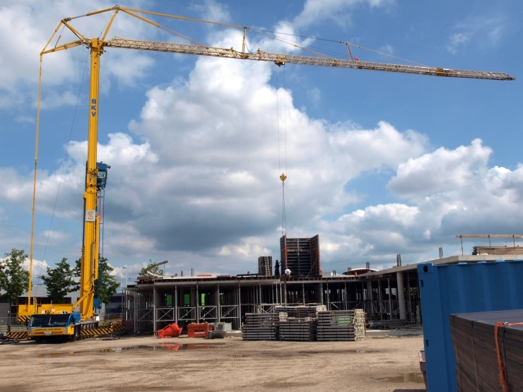
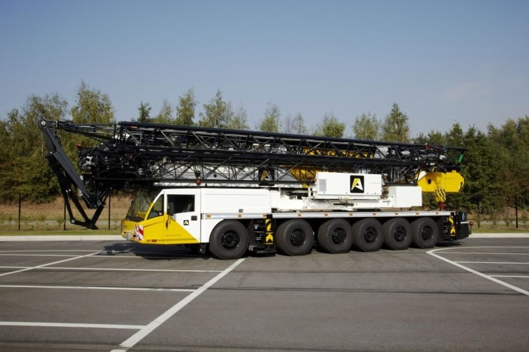
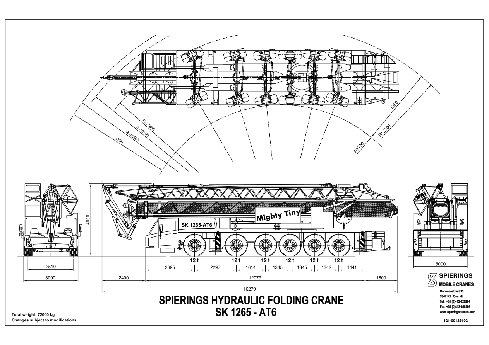
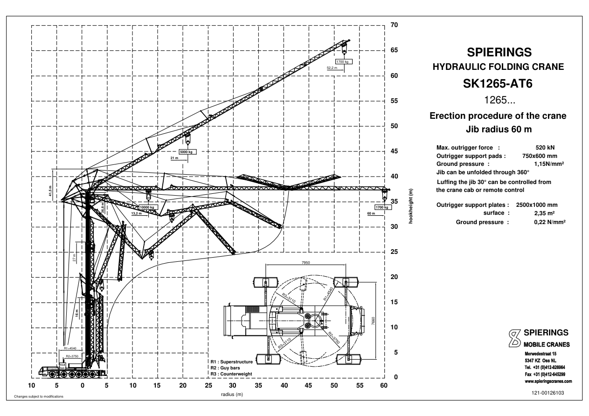

# Spierings SK1265-AT6 — 이미지 제작·모델링 참고 자료

조사일: 2026-09-21. 목적은 외형 이미지와 이후 3D 모델링을 위한 자료 정리다. 아래 치수는 선택한 구형 제원 도면의 구성에 따른다.

## 1. 참고 글의 장비 식별

사용자가 제공한 글은 「크레인 종류 [제6편 이동식타워크레인 (1탄) spierings mobile cranes]」다. 본문에는 **SK498-AT4, SK599-AT5, SK1265-AT6**가 차례로 등장한다. 처음에는 Liebherr MK 계열도 비교하지만 글의 주된 대상은 Spierings다. [원문](https://blog.naver.com/babotak/220461270145)

대형 장비의 이미지 기준으로 **SK1265-AT6, 60m 구성**을 선택한다. 이는 조사상 추천이며 사용자가 특정 기종을 확정한 것은 아니다. 원문의 “SK1256” 표기는 다른 부분의 모델명·첨부파일명 및 제조사 도면과 대조하면 SK1265의 오기로 보인다.

## 2. 치수의 기준 문서

아래 표는 제조사 다운로드 페이지의 **Previous models → SK1265-AT6**에 연결된 [공식 구형 제원 PDF](https://www.spieringscranes.com/wp-content/uploads/Specs-SK1265_EN.pdf)를 기준으로 한다. 페이지 번호는 PDF 첫 장을 1쪽으로 계산했다.

| 항목 | 도면값 | 근거·해석 |
|---|---:|---|
| 차체 축 수 | 6축 | 2쪽 측면도 |
| 운송 시 전체 길이 | 16.279m | 2쪽, 접힌 장비를 포함한 전체 길이 |
| 운송 폭 / 높이 | 3.000m / 4.000m | 2쪽 |
| 전체 중량 | 72,000kg | 2쪽, 축당 12t 표기 |
| 최대 작업 반경 | 60m | 1·3쪽, 선회 중심을 기준으로 읽을 것 |
| 최대 인양 하중 | 10t, 반경 13.2m까지 | 1쪽, 넓은 아웃리거 구성 |
| 60m 끝단 하중 | 1.7t | 같은 구성; 좁은 지지 구성과 혼용 금지 |
| 수평 지브 아래 높이 | 27.4m / 37.2m | 1쪽, 타워 전개 구성에 따라 다름 |
| 수평 지브 시 훅 높이 | 25.2m / 35m | 1쪽; 지브 아래 높이와 다른 값 |
| 30° 기울인 지브의 최대 훅 높이 | 64.2m | 1쪽; 같은 위치의 수평 반경은 52.2m |
| 아웃리거 지지 베이스 | 7.95 × 7.66m | 1·3·7쪽; 축소 폭 5.72m 구성도 별도 존재 |

최대 반경 60m와 최대 훅 높이 64.2m는 서로 다른 지브 자세의 값이다. 한 장면에서 동시에 달성하는 좌표로 그리면 안 된다. 또한 10t은 모든 반경에 적용되는 하중이 아니다.

## 3. 실제 사진에서 읽어야 할 외형

아래 두 장은 제공된 블로그의 SK1265-AT6 구간에 있는 참고 사진이다. 색상과 로고는 사진 속 운용사의 도장 사례다.

사진의 형태를 기준으로 다음을 모델링한다.

| 부분 | 외형 포인트 | 모델링할 때의 구분 |
|---|---|---|
| 차량 | 긴 저상 차체, 전면 도로 주행 운전실, 여러 바퀴 | 차체·운전실·각 축·바퀴를 분리 |
| 마스트 | 사각 박스 단면의 매끈한 기둥과 겹쳐지는 신축 구간 | 격자 타워로 바꾸지 않고 신축 구간별 분리 |
| 지브 | 가늘고 긴 삼각형 격자 구조, 반복되는 대각재 | 접힘 관절과 구간 경계를 사진·도면에 맞춤 |
| 상부 지지 구조 | 마스트 위 삼각 프레임, 지브 위 지지대와 길게 연결된 지지재 | 구조 부재와 가는 와이어를 구별 |
| 하부 선회부·균형추 | 차체 위 회전 프레임, 후방의 묵직한 구조와 지지재 연결 | 일반 고정 타워의 긴 상부 카운터지브를 임의로 추가하지 않음 |
| 조종실 | 차량 운전실과 별개인, 마스트 옆 유리창이 많은 작은 조종실 | 참고 사진에서는 마스트 중간 높이에 위치 |
| 지지 다리 | 차체에서 넓게 뻗는 아웃리거와 바닥 받침 | 작업 상태에서는 4개 지지점을 표현 |
| 인양 장치 | 지브 아래 이동 트롤리, 수직 로프, 훅 블록 | 로프가 지브 중간 트롤리에서 내려오는 형태 |
| 표면 | 노란 도장, 어두운 타이어·유리, 금속 연결부, 일부 경고 줄무늬 | 색상은 선택한 사진을 따르고 제조사 고정색으로 단정하지 않음 |

이 표는 사진 관찰 및 제작용 분해 제안이다. 각 부재의 두께나 조종실 폭을 측정값으로 주장하지 않는다.

## 4. 도면과 CAD 자료

### 구형 SK1265-AT6 제원 PDF — 우선 참고

- [제조사 원본](https://www.spieringscranes.com/wp-content/uploads/Specs-SK1265_EN.pdf)
- 로컬: `references/spierings-sk1265-at6-legacy-specifications.pdf`
- **2쪽:** 운송 상태 측면·전면·회전 궤적. 차체 길이, 바퀴 배치, 접힌 지브를 잡는 기준.
- **3쪽:** 전개 과정과 작업 범위. 마스트·지브·지지재의 관계를 읽는 기준.
- **4–5쪽:** 지지 폭에 따른 작업 자세 비교.
- **7쪽:** 아웃리거 평면 치수, 균형추·지지재의 회전 범위.

바퀴 배치를 정밀하게 잡을 때는 앞에서 뒤로 축간 거리를 **2.297 / 1.614 / 1.345 / 1.345 / 1.342m**로 읽는다. 6축을 등간격으로 배치하면 원형과 달라진다. 측면도에서 차량 앞쪽 기준부터 마지막 뒤쪽 기준까지는 12.079m이고, 접힌 장비의 앞뒤 돌출을 포함하면 전체 16.279m다. 이 치수선의 기준점을 원본 도면과 함께 확인해야 한다.

전개 도면은 여러 순간의 자세가 겹쳐 표시돼 있다. 완성된 작업 상태에 이 겹친 지브들을 전부 넣지 않는다.

### 공식 DWG ZIP — 정밀 외곽선 확인용 후보

- [DWG 다운로드](https://www.spieringscranes.com/wp-content/uploads/SK1265-DWG-1.zip)
- 로컬: `references/spierings-sk1265-dwg.zip`
- 압축 파일 내부 **DWG 11개**와 압축 무결성을 확인했다. 일부 파일명이 구형 제원 PDF의 도면 번호와 대응한다.
- 현재 eLift 페이지에서 제공하는 자료다. DWG 내부 엔티티·레이어와 연식별 일치 여부는 아직 확인하지 않았다. 완성된 Blender/FBX/GLB 모델로 간주하지 않는다.

## 5. 추가 외형·동작 자료

| 자료 | 얻을 수 있는 정보 |
|---|---|
| [현재 SK1265-AT6 eLift 공식 페이지](https://www.spieringscranes.com/en/mobile-tower-crane/sk1265-at6-elift/) | 실제 사진, 전개 단계 7장, 영상, 브로셔·PDF·DWG 링크 |
| [공식 페이지에 연결된 영상](https://www.youtube.com/watch?v=WK4Wa2DxNOU) | 전개 동작 확인용 링크; 이번 조사에서는 영상 전체를 프레임별 검증하지 않음 |
| [현재 eLift 제원 PDF](https://www.spieringscranes.com/wp-content/uploads/Specificaties-SK1265-AT6-eLift_ENG_-1.pdf) | 52m 및 60m 구성의 하중표. 52m 구성이 있다고 전체 모델의 최대 지브를 52m로 해석하지 않을 것 |
| [제조사 전체 다운로드](https://www.spieringscranes.com/en/downloads/) | SK498-AT4·SK599-AT5 등 이전 모델의 제원 자료 |

현재 eLift 웹페이지는 지브 아래 높이를 40.5m로 표시하지만, 이번 기준 구형 PDF는 27.4/37.2m로 표기한다. 그 차이가 정확히 어떤 연식·구성에서 생기는지는 이번 조사에서 확정하지 않았다. 이번 이미지의 비례는 구형 PDF와 블로그 사진에 맞추고, 현재 모델의 치수를 섞지 않는다.

현재 제조사 사이트의 `Leaflet-SK498-AT4_ENG.pdf` 링크를 열었을 때 내용은 SK377-AT3로 식별됐다. SK498 모델링에는 파일명만 믿지 말고 본문의 모델명을 다시 확인해야 한다.

## 6. 이미지 제작에 사용할 기본 설정안

아래는 실측 정보와 구별되는 **제작 제안**이다.

- 기준 장비: 구형 Spierings SK1265-AT6, 6축, 60m 지브 구성.
- 첫 이미지: 지브를 수평으로 완전히 펼친 작업 상태, 전체가 들어오는 3/4 시점, 단순한 밝은 배경.
- 비례 기준: 운송 전체 길이 16.279m, 폭 3m; 전개 시 지브 아래 높이 37.2m. 운송 높이 4m를 전개 상태 높이로 쓰지 않는다.
- 외형: 노란 박스형 신축 마스트, 긴 격자 지브, 상부 삼각 프레임과 지지재, 6축 차체, 펼친 아웃리거, 별도 조종실, 트롤리와 훅.
- 조종실: 블로그 작업 사진의 중간 높이 위치를 우선. 현재 공식 사진의 상단 위치와 임의로 혼합하지 않는다.
- 화면 구성: 지브 끝과 아웃리거가 잘리지 않도록 여백 확보. 로고·치수 문자 없이 형태를 먼저 검토.
- 다음 이미지: 같은 장비의 측면 정사영, 전면·후면, 운송 상태. 각 이미지 사이 바퀴 수·색상·조종실 위치를 일관되게 유지.

아직 확정되지 않은 부재 단면, 핀·힌지 구조, 타이어 상세 치수는 추가 도면을 읽거나 사진과 대조해야 한다. 생성 이미지는 외관 검토용으로 쓰고 치수 기준은 원본 도면에 둔다.

## 7. 참고 이미지 출처

- `blog-sk1265-at6-working.jpg`: [블로그 사진 원본](https://blogfiles.pstatic.net/20150825_241/babotak_1440468914444qAEGs_JPEG/Spierings_SK1265-AT6_p4.jpg)
- `blog-sk1265-at6-folded.jpg`: [블로그 사진 원본](https://blogfiles.pstatic.net/20150825_48/babotak_1440468913397Mvq7z_JPEG/a2-60m-SK1265-AT6.jpg)
- `official-elift-working.jpg`: [제조사 eLift 전개 사진](https://www.spieringscranes.com/wp-content/uploads/SK1265-AT6-eLift-opbouw-7-1440x1079.jpg), 현재 모델의 보조 시각 자료.

원본 사진·도면의 저작권은 각 권리자에게 있다. 이 폴더는 이미지 제작과 모델링을 위한 출처가 있는 참고 자료 모음이다.
